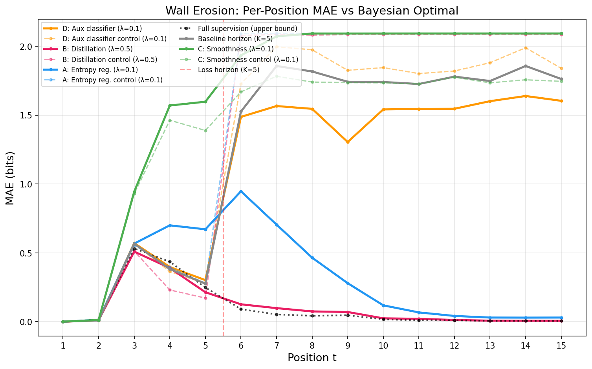

# Wall Erosion Experiment

Testing the **synchronization tax prediction**: can the Shannon/Kolmogorov "wall" be eroded by providing indirect gradient flow to unrewarded positions?

## Background

[Misra (2025)](https://medium.com/@vishalmisra/the-wall-between-shannon-and-kolmogorov-65a9d7e8fb7c) gave a clean demonstration of the phenomenon: when a transformer is trained on modular linear recurrences (`x_{t+1} = ax_t + b mod 17`) with cross-entropy loss computed only at positions 1-K, the model achieves near-Bayesian performance at trained positions but fails catastrophically at untrained positions. Misra interprets this "wall" as an intrinsic boundary: LLMs compile localized prediction circuits based on pattern matching (Shannon) rather than learning generalized, position-independent algorithms (Kolmogorov).

Initially, this repository sought to test an alternative interpretation based on the [Maintaining Divergence](https://www.symmetrybroken.com/maintaining-divergence/#the-three-part-decomposition) framework. We hypothesized that the wall might not be an intrinsic limit of the architecture, but rather an artifact of where training allocates resources (the "synchronization tax"). 

**The Original Prediction:**
> If the wall simply reflects where synchronization costs are paid, providing a generic "maintenance subsidy" (indirect, non-task-specific gradient flow) to unrewarded positions should erode it. 

**The Findings:**
This repository implements that test, and **the results strongly validate Misra's original Shannon/Kolmogorov divide.** The control experiments demonstrate that generic gradient flow is completely insufficient to erode the wall (although entropy regularization still suggests the barrier may be thinner than the Shannon/Kolmogorov framing implies). The transformer only succeeds at unrewarded positions when explicit, *task-relevant* supervision (distillation from a teacher) is provided at those specific coordinates. 

**Conclusion:**
In the language of the *Maintaining Divergence* framework, this experiment proves that the "synchronization tax" for algorithmic execution cannot be paid with generic compute. Because the model has not learned a universal Kolmogorov program, it requires the teacher to supply the missing informational beliefs at every novel position. The wall is indeed an intrinsic limit of how standard autoregressive transformers generalize.

## Results

The wall **is not intrinsic**. Two mechanisms completely eliminate it:

| Condition | Trained MAE | Untrained MAE | Wall Ratio |
|-----------|------------|---------------|------------|
| Baseline-Horizon (the wall) | 0.247 | 1.755 | **7.1x** |
| A: Entropy regularization | 0.390 | **0.272** | **0.7x** |
| A: Entropy control (uniform) | 0.248 | 2.092 | 8.4x |
| B: Soft distillation | 0.225 | **0.045** | **0.2x** |
| B: Distill control (random) | 0.185 | 2.084 | 11.3x |

Matched controls that provide gradient flow but no task-relevant information preserve the wall, confirming the effect is driven by *information content*, not gradient flow alone.

Full results: [`results/RESULTS.md`](results/RESULTS.md)

### Per-position MAE



## Mechanisms tested

| Mechanism | What it provides at unrewarded positions | Wall erosion |
|-----------|----------------------------------------|-------------|
| **A: Entropy reg.** | Target entropy (how uncertain to be) | Complete |
| **B: Distillation** | Soft output distribution from trained teacher | Complete |
| **C: Smoothness** | Hidden-state continuity constraint | None (regularization artifact) |
| **D: Aux classifier** | Binary "is this a program?" signal | Modest |

Each mechanism has a matched control providing gradient flow with no task-relevant information.

## Reproducing

```bash
# Setup
python -m venv .venv && source .venv/bin/activate
pip install -r requirements.txt

# Reproduce baselines (use --device mps on Apple Silicon, --device cuda on NVIDIA)
python wall_erosion_experiment.py --mechanism none --loss_horizon 15 \
    --n_steps 10000 --eval_every 5000 --device mps --seeds 42

python wall_erosion_experiment.py --mechanism none \
    --n_steps 10000 --eval_every 5000 --device mps --seeds 42

# Train teacher (for distillation)
python wall_erosion_experiment.py --train_teacher \
    --n_steps 10000 --eval_every 5000 --device mps --seeds 42

# Run a mechanism
python wall_erosion_experiment.py --mechanism entropy --subsidy_lambda 0.1 \
    --n_steps 10000 --eval_every 5000 --device mps --seeds 42

# Run with control
python wall_erosion_experiment.py --mechanism entropy --control --subsidy_lambda 0.1 \
    --n_steps 10000 --eval_every 5000 --device mps --seeds 42

# Full matrix (all mechanisms x controls x lambda sweep x 3 seeds)
python wall_erosion_experiment.py --run_matrix --seeds 42 43 44 --device mps
```

## Upstream

The base task (modular linear recurrence wind tunnel) is from [vishalmisra/bayesian-wind-tunnel](https://github.com/vishalmisra/bayesian-wind-tunnel). Files `recurrence_bwt.py` and `recurrence_extrapolation.py` are from that repo and provide data generation, Bayesian ground truth computation, and evaluation.

## License

This experiment code is released under the MIT License. The upstream files (`recurrence_bwt.py`, `recurrence_extrapolation.py`) are from [vishalmisra/bayesian-wind-tunnel](https://github.com/vishalmisra/bayesian-wind-tunnel) and are subject to its license terms.
